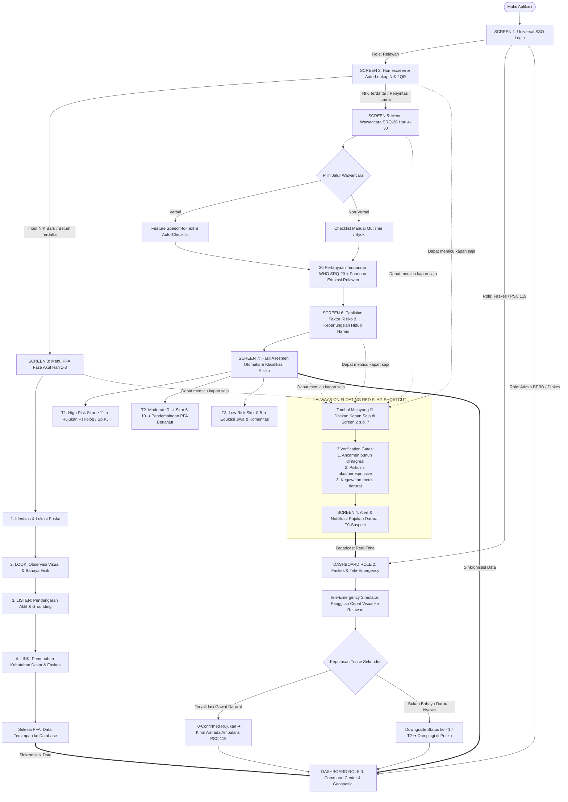

# 📋 PANDUAN LENGKAP ALUR SISTEM (SYSTEM FLOW & LOGIC)
## Sistem Triase & Rujukan Kesehatan Mental Bencana Terpadu — RAPID-MIND

Dokumen ini menjelaskan secara rinci seluruh alur operasional, logika sistem, mekanisme triase dua pintu (*Two-Tiered Triage*), serta interaksi pengguna dari **Screen 1 sampai Screen 7**, beserta integrasinya ke **Dashboard Fasilitas Kesehatan (Faskes/PSC 119)** dan **Dashboard BPBD/Dinas Kesehatan**.

---

## 🗺️ 1. Diagram Alur Keseluruhan Sistem (System Flowchart)

---

## 🔐 2. Screen 1: Universal SSO Login (RBAC)

* **Tujuan**: Mengamankan akses sistem dan mengarahkan pengguna secara otomatis ke antarmuka yang sesuai dengan tanggung jawab kewenangannya (*Role-Based Access Control*).
* **3 Role yang Didukung**:
  1. **Role 1: Relawan Lapangan (`volunteer`)**
     * Mengarahkan ke antarmuka **Mobile PWA** yang ringan dan adaptif untuk perangkat genggam di posko pengungsian.
  2. **Role 2: Tenaga Kesehatan / Faskes / PSC 119 (`hospital`)**
     * Mengarahkan ke antarmuka klinis untuk menerima panggilan darurat **T0-Suspect**, validasi visual Tele-Emergency, dan pemesanan tempat tidur IGD psikiatri.
  3. **Role 3: Admin & Pengambil Kebijakan BPBD / Dinkes (`admin`)**
     * Mengarahkan ke antarmuka **Pusat Komando (Command Center)** makro dengan peta geospasial posko dan agregat statistik wilayah.
* **Fitur 1-Click Demo Pass**:
  * Tombol cepat login satu klik untuk masing-masing peran memudahkan tim penilai/juri atau personel baru dalam menguji aplikasi tanpa perlu mengetik ulang kredensial.

---

## 🔍 3. Screen 2: Homescreen & Auto-Lookup NIK / QR Code

* **Tujuan**: Mencegah redundansi input data, mengenali riwayat penanganan penyintas secara instan, dan membedakan kebutuhan penanganan fase akut versus fase lanjutan.
* **Komponen Antarmuka**:
  * Input NIK 16 Digit / Nomor ID Gelang Posko / Nama Lengkap.
  * Tombol simulasi pemindaian QR Code gelang posko.
  * Tombol contoh cepat: *NIK Lama (Dewi Sartika)* dan *NIK Baru*.
* **Logika Kerja Sistem (Auto-Lookup Logic)**:
  1. **Jika NIK Terdaftar (Penyintas Lama)**:
     * Sistem memuat rekam medis longitudinal dari basis data.
     * Menampilkan riwayat intervensi PFA sebelumnya (waktu, observasi visual, catatan pendengaran aktif, dan kebutuhan dasar).
     * Menampilkan tombol langsung menuju **Screen 5: Menu Wawancara SRQ-20 (Hari 4–30)** tanpa meminta input ulang identitas dasar.
  2. **Jika NIK Belum Terdaftar (Penyintas Baru)**:
     * Sistem membuka formulir pendaftaran kilat (Nama, Usia, Gender, Posko).
     * Setelah disimpan, sistem langsung mengarahkan relawan ke **Screen 3: Menu PFA (Fase Akut: Hari 1–3)**.

---

## 🛡️ 4. Screen 3: Menu PFA (Fase Akut: Hari 1–3)

* **Tujuan**: Memberikan panduan terstruktur bagi relawan untuk melakukan *Psychological First Aid* (PFA) sesuai pedoman internasional WHO/IASC pada 72 jam pertama pascabencana.
* **Protokol Terpandu 4 Langkah**:
  1. **Identitas & Posko (Auto-Fill)**: Mengunci data penyintas dari hasil lookup.
  2. **LOOK (Observasi Visual & Tanda Bahaya)**:
     * Mengamati keamanan lingkungan tenda posko.
     * Mengidentifikasi adanya cedera fisik yang belum ditangani dokter.
     * Mengamati tanda pembekuan emosional parah (*mutisme, shock, unresponsive*).
  3. **LISTEN (Pendengaran Aktif & Penenangan)**:
     * Menyapa dengan santun dan empati.
     * Mendengarkan tanpa memaksa penyintas menceritakan ulang kronologi bencana.
     * Memandu teknik penenangan ritmik (*Grounding 5-4-3-2-1* dan pernapasan 4-7-8).
     * Menyediakan kotak catatan ungkapan perasaan korban.
  4. **LINK (Pemenuhan Kebutuhan Dasar & Rujukan)**:
     * Menghubungkan ke distribusi air bersih dan dapur umum posko.
     * Memastikan alas tidur kering dan selimut hangat.
     * Memfasilitasi reunifikasi / pencarian anggota keluarga yang terpisah.
     * Menghubungkan ke pos kesehatan untuk obat rutin (hipertensi/diabetes).
     * Memberikan informasi resmi BMKG/BPBD guna menangkal hoaks gempa susulan.
* **Output**: Data tersimpan ke rekam medis penyintas dengan status kesiapan untuk penapisan lanjutan di Hari 4–30.

---

## 🚨 5. Always-On Floating Shortcut: Red Flag Emergency (T0)

* **Tujuan**: Memastikan tidak ada kasus gawat darurat psikiatri atau ancaman nyawa yang tertunda oleh pengisian kuesioner panjang.
* **Karakteristik Tombol Melayang (FAB)**:
  * Berwarna merah menyala dengan ikon denyut (*pulsing*) 🚨 **Red Flag Emergency**.
  * **Wajib selalu tampil dan melayang di pojok kanan bawah dari Screen 2 hingga Screen 7**.
* **Logika 3 Verification Gates**:
  Saat ditekan, sistem menampilkan jendela konfirmasi singkat 3 gerbang:
  1. `[ ]` **Gerbang 1**: Ancaman membahayakan diri sendiri (ideasi bunuh diri) atau orang lain (agresi akut).
  2. `[ ]` **Gerbang 2**: Psikosis akut / halusinasi berat / mutisme syok (*unresponsive* verbal).
  3. `[ ]` **Gerbang 3**: Kegawatdaruratan medis / cedera fisik berat yang menyertai distres mental.
* **Dampak Eksekusi (Screen 4: Alert Rujukan Darurat T0)**:
  * Seketika mengunci status pasien menjadi **T0-Suspect**.
  * Mengunci titik koordinat GPS posko lapangan.
  * Menyiarkan notifikasi prioritas tinggi ke Dashboard Role 2 (Faskes / PSC 119).
  * Memberikan instruksi keselamatan wajib bagi relawan: *dampingi 100% tanpa jeda, amankan benda berbahaya, dan siagakan HP untuk panggilan Tele-Emergency*.

---

## 📝 6. Screen 5: Menu Wawancara SRQ-20 (Fase Lanjutan: Hari 4–30)

* **Tujuan**: Melakukan penapisan terstandar internasional (*Self-Reporting Questionnaire - 20 items* WHO) pada fase stabilisasi untuk mendeteksi dini risiko Depresi, Gangguan Kecemasan, dan PTSD.
* **Fitur Utama**:
  1. **Dual-Path Switcher**:
     * **Jalur Verbal**: Menggunakan wawancara tanya-jawab dengan bantuan mikrofon Speech-to-Text.
     * **Jalur Non-Verbal**: Dirancang khusus bagi penyintas yang mengalami mutisme selektif atau hambatan wicara akibat trauma (relawan membacakan dan penyintas memberi isyarat/anggukan).
  2. **Speech-to-Text (STT) & NLP Keyword Auto-Checklist**:
     * Relawan dapat menekan tombol rekam suara saat penyintas menceritakan keluhannya.
     * Algoritma NLP mendeteksi kata kunci (*headache, susah tidur, cemas, gemetar, sedih mendalam*) dan secara otomatis mencentang nomor soal yang relevan.
  3. **Human-in-the-Loop Control (Prinsip Wajib)**:
     * Otomasi STT tidak menggantikan keputusan relawan. Relawan memiliki kendali penuh untuk menambah centang (*Ya*) atau membatalkan centang (*Tidak*) berdasarkan observasi klinis lapangan.
  4. **Panduan Edukasi Relawan (Guided Tooltip di Setiap Soal)**:
     * Setiap soal memiliki tombol *tooltip* panduan agar relawan dapat menjelaskan pertanyaan dengan bahasa yang netral dan tidak bias tafsir.
  5. **Proteksi Khusus Butir #17 (Pikiran Mengakhiri Hidup)**:
     * Jika butir 17 terjawab **Ya**, sistem memicu spanduk merah darurat dan otomatis mengarahkan hasil akhir ke **T0 (Emergency)** tanpa memandang jumlah skor lainnya.

---

## ⚖️ 7. Screen 6: Penilaian Faktor Risiko & Keberfungsian Harian

* **Tujuan**: Mengukur sejauh mana trauma bencana melumpuhkan keberfungsian hidup sehari-hari (*functional impairment*).
* **Indikator yang Dievaluasi**:
  1. **Pola Tidur**: Kurang dari 3 jam atau mimpi buruk terus-menerus.
  2. **Asupan Makan**: Penurunan drastis selama lebih dari 48 jam berturut-turut.
  3. **Perawatan Diri**: Tidak mampu membersihkan diri/mandi tanpa bantuan penuh.
  4. **Fungsi Sosial**: Menarik diri total atau menolak berinteraksi dengan keluarga dan tetangga tenda.
  5. **Agitasi Perilaku**: Ledakan amarah mendadak atau histeria saat mendengar suara bising sekitar posko.

---

## 📊 8. Screen 7: Hasil Asesmen Otomatis & Klasifikasi Tingkat Risiko

* **Logika Mesin Penilai (Triage Engine Scoring)**:

| Tingkat Risiko | Kriteria Penentuan | Protokol Intervensi Tindak Lanjut |
| :--- | :--- | :--- |
| **T0 — EMERGENCY** | Tombol Red Flag ditekan **ATAU** Butir 17 SRQ bernilai **Ya** | Peringatan darurat instan ke PSC 119 dan RS Rujukan. Dampingi penyintas 100% tanpa jeda, koordinasikan penjemputan ambulans via tele-emergency. |
| **T1 — HIGH RISK** | Skor SRQ-20 **≥ 11** **ATAU** hendaya fungsi harian berat (≥ 3) | Rujukan ke Psikolog Klinis atau Dokter Spesialis Kedokteran Jiwa (Sp.KJ). Dampingi dengan PFA terstruktur dan jadwalkan evaluasi 24 jam. |
| **T2 — MODERATE RISK**| Skor SRQ-20 **6 – 10** **ATAU** hendaya fungsi sedang (1–2) | Pendampingan PFA berlanjut oleh *Resilience Coach* / Relawan terlatih. Berikan teknik grounding pernapasan dan re-evaluasi 3–7 hari. |
| **T3 — LOW RISK** | Skor SRQ-20 **0 – 5** dengan fungsi harian terjaga | Kondisi psikologis stabil dalam batas adaptasi wajar. Berikan edukasi kesehatan jiwa dan libatkan dalam kegiatan gotong royong posko. |

* **Integrasi Basis Data**:
  Hasil asesmen seketika tersimpan ke dalam repositori lokal (Offline-First) dan disinkronkan ke basis data terpusat saat sinyal internet tersedia.

---

## 🏥 9. Alur Triase Sekunder (Two-Tiered Triage) di Dashboard Faskes & PSC 119 (Role 2)

* **Tujuan**: Mencegah kepanikan lapangan membebani rumah sakit secara berlebihan dengan menerapkan filter validasi medis dua pintu (*Two-Tiered Triage*).
* **Tahapan Alur**:
  1. **Notifikasi Masuk**: Panggilan darurat **T0-Suspect** dari relawan masuk ke panel kiri dashboard Faskes dengan kartu berkedip merah (*pulsing alert*).
  2. **Tele-Emergency Workspace**: Tenaga medis di rumah sakit/PSC 119 membuka jendela Tele-Emergency untuk melakukan panggilan suara/video cepat ke HP relawan selama 1–2 menit guna memverifikasi kondisi visual penyintas.
  3. **Keputusan Validasi Sekunder**:
     * **Opsi A: "Konfirmasi Rujukan (T0-Confirmed)"**
       * Jika kondisi penyintas terbukti mengancam nyawa/psikosis akut.
       * Sistem otomatis menerbitkan instruksi pengiriman armada ambulans PSC 119 ke lokasi posko.
     * **Opsi B: "Downgrade Status (ke T1 atau T2)"**
       * Jika hasil verifikasi menunjukkan reaksi histeria biasa tanpa bahaya darurat nyawa.
       * Pasien tetap ditangani di posko oleh tim relawan terlatih tanpa perlu mobilisasi ambulans darurat.
  4. **Pelacakan Armada (Ambulance Transport Tracking)**:
     * Pemantauan status penjemputan: *Menuju Posko ➔ Tiba di Posko ➔ Dalam Perjalanan ke RS ➔ Rawat Inap IGD Psikiatri*.

---

## 🗺️ 10. Alur Pengambilan Kebijakan di Dashboard BPBD & Dinkes (Role 3)

* **Tujuan**: Menyediakan visibilitas makro berbasis data geospasial bagi pimpinan penanggulangan bencana dalam mendistribusikan tenaga psikolog dan bantuan logistik obat secara presisi.
* **Fitur Utama**:
  1. **Interactive Geospatial Heatmap**:
     * Peta sebaran posko pengungsian dengan kode warna dinamis:
       * **Merah Kedip**: Posko memiliki kasus **T0 (Emergency)** aktif.
       * **Oranye**: Posko didominasi kasus **T1 (High Risk)**.
       * **Kuning**: Posko didominasi kasus **T2 (Moderate Risk)**.
       * **Hijau**: Posko dalam kondisi stabil **T3 (Low Risk)**.
     * Klik pin posko untuk melihat pop-up: *Jumlah Pengungsi, Sebaran Risiko, dan Relawan yang Bertugas*.
  2. **Filter Fase Penanganan Bencana**:
     * Menyaring data berdasarkan fase: *Semua Fase*, *Fase Akut (Hari 1–3)*, atau *Fase Lanjutan (Hari 4–30)*.
  3. **Analitik Eksekutif (Stat Cards & Grafik)**:
     * Menampilkan perbandingan jumlah kasus T0, T1, T2, dan T3 secara *real-time*.
  4. **Database Rekam Medis Longitudinal**:
     * Tabel master seluruh penyintas berbasis NIK untuk pemantauan perkembangan kesehatan jiwa hingga 30 hari pascabencana.
  5. **Ekspor Laporan Resmi**:
     * Tombol unduh laporan agregat wilayah format PDF dan Excel untuk rapat koordinasi lintas sektor BNPB/Kemenkes.

---

## 👤 11. Alur Manajemen Pengguna (Hak Akses Tambah User oleh Admin)

* **Kebijakan Keamanan**:
  Hanya akun dengan peran **Admin** yang memiliki otorisasi untuk menambahkan akun pengguna baru ke dalam sistem RAPID-MIND.
* **Langkah Kerja**:
  1. Admin membuka tab **Kelola Pengguna** pada Dashboard Command Center.
  2. Klik tombol **"+ Tambah User Baru"**.
  3. Memilih Peran Pengguna (*Volunteer*, *Rumah Sakit / Faskes*, atau *Admin*).
  4. Mengisi Nama Lengkap, Username Login, Password Awal, Email, Nomor Telepon, Nomor Badge, serta Instansi / Penugasan Posko.
  5. Menyimpan data. Pengguna baru seketika aktif dan dapat langsung digunakan untuk masuk (*sign in*) dari portal login utama.

---

*Dokumen ini dirancang sebagai acuan arsitektur sistem, operasional lapangan, dan bahan presentasi teknis pengujian sistem RAPID-MIND.*
